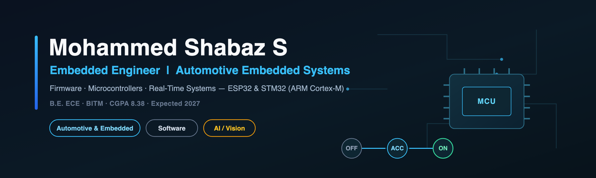
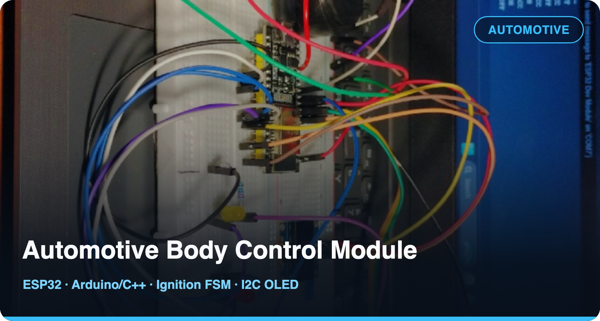
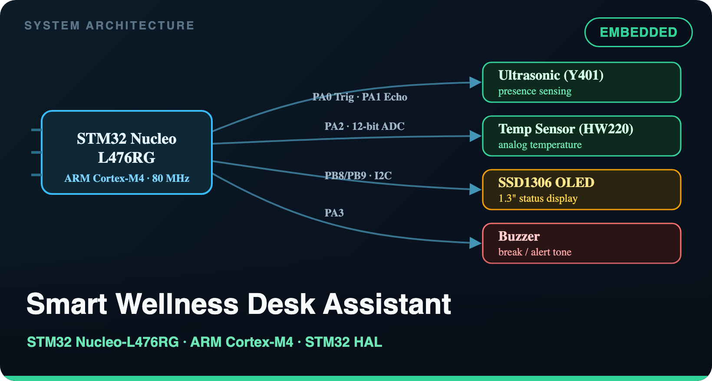
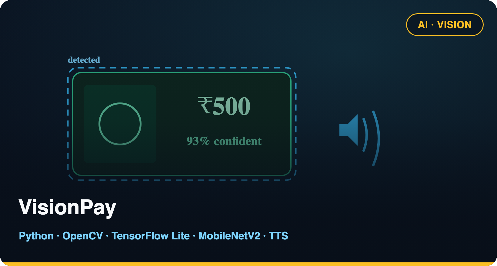

<!-- Profile banner -->

  

  
  
  
  

  
  
  

---

## Professional Snapshot

| Area | Details |
|---|---|
| **Current** | Final-year B.E. Electronics & Communication Engineering, BITM · Student Intern @ Nokia |
| **Primary track** | Embedded Engineer · Automotive Embedded Systems |
| **Secondary** | Software Engineering |
| **Supporting** | AI / Computer Vision |
| **Engineering focus** | Microcontroller firmware, finite-state machines, non-blocking real-time control |
| **Education** | BITM · Expected 2027 · CGPA 8.38 |

I build embedded and automotive firmware — microcontroller systems, state machines and deterministic real-time loops in Embedded C/C++ on ESP32 and STM32 (ARM Cortex-M) — and back it with practical software and computer-vision work. Currently working as a Student Intern at Nokia.

---

## Focus

<table>
  <tr>
    <td width="33%" valign="top">
      <h3>🚗 Automotive &amp; Embedded</h3>
      
Firmware for microcontrollers — finite-state machines, sensor interfacing, GPIO/I2C/ADC, and non-blocking real-time control, including automotive-oriented prototypes on ESP32 and STM32 (ARM Cortex-M4).

    </td>
    <td width="33%" valign="top">
      <h3>💻 Software</h3>
      
Practical software in C, C++, Python and SQL, with Android Studio and Git/GitHub. I care about clean, testable, debuggable code and predictable behaviour.

    </td>
    <td width="33%" valign="top">
      <h3>👁️ AI / Computer Vision</h3>
      
Project-level work with OpenCV, TensorFlow Lite and MobileNetV2 — real-time, offline inference pipelines that run on plain CPUs.

    </td>
  </tr>
</table>

---

## Tech Stack

  

- **Embedded &amp; Firmware:** Embedded C · Microcontrollers · ARM Cortex-M4 · finite-state machines · non-blocking real-time design · GPIO · I2C · ADC · timers · sensor interfacing · debugging
- **Platforms &amp; Tools:** ESP32 · STM32 (Nucleo-L476RG) · STM32CubeIDE · Arduino · Android Studio · Git/GitHub
- **Programming:** C · C++ · Embedded C · Python · SQL
- **AI / Computer Vision:** OpenCV · TensorFlow Lite · MobileNetV2 · Text-to-Speech
- **CS Foundations:** Data Structures &amp; Algorithms · Operating Systems · DBMS · Computer Networks

Learning next (not current skills): UART/SPI · RTOS/FreeRTOS · CAN-bus networking toward automotive systems.

---

## Featured Projects

<h3><a href="https://github.com/MdShabazS/Automotive-Body-Control-Module-ESP32">Automotive Body Control Module</a> &nbsp;Individual · Embedded / Automotive</h3>

ESP32 firmware modelling a vehicle body-control ECU (photo: the actual breadboard build).

- **OFF/ACC/ON ignition FSM** driving 6+ functions — indicators, synchronized hazard, brake logic, buzzer, OLED dashboard.
- Non-blocking `millis()` loop (zero `delay()`), 30&nbsp;ms brake debounce, 10&nbsp;Hz I2C OLED refresh, clean GPIO abstraction, edge-triggered logging.
- **Stack:** ESP32 · Arduino/C++ · Finite-State Machine · GPIO · I2C OLED &nbsp;—&nbsp; [Repository →](https://github.com/MdShabazS/Automotive-Body-Control-Module-ESP32)

<h3><a href="https://github.com/MdShabazS/Smart-Wellness-Desk-Assistant">Smart Wellness Desk Assistant</a> &nbsp;College team project · Embedded</h3>

STM32 desk-wellness device on ARM Cortex-M4 (image: the project wiring diagram).

- Ultrasonic presence + 12-bit ADC temperature sensing, I2C SSD1306 OLED and timer-driven alerts via a non-blocking finite-state machine.
- **My contribution:** sensor interfacing, wiring, and testing/debugging in STM32CubeIDE within the team.
- **Stack:** STM32 Nucleo-L476RG · ARM Cortex-M4 · STM32 HAL · STM32CubeIDE · Embedded C &nbsp;—&nbsp; [Repository →](https://github.com/MdShabazS/Smart-Wellness-Desk-Assistant)

<h3><a href="https://github.com/MdShabazS/visionpay">VisionPay</a> &nbsp;Individual · AI / Computer Vision</h3>

Offline, real-time Indian-currency detector with spoken output for visually impaired users.

- ~400 images/denomination across 6 classes (₹10–₹500); MobileNetV2 → TensorFlow Lite (~93% reported validation accuracy), running offline on CPU.
- Confidence/margin gating, temporal smoothing, a background class and an auto-count mode.
- **Stack:** Python · OpenCV · TensorFlow Lite · MobileNetV2 · Text-to-Speech &nbsp;—&nbsp; [Repository →](https://github.com/MdShabazS/visionpay)

---

## 🚧 Currently Building

- **[AEGIS](https://github.com/MdShabazS/aegis)** — an AI-assisted emergency-response platform where **AI recommends and a human dispatcher decides**. *Team project · architecture / design stage — not yet built.*
- **Automotive-embedded depth** — moving from I2C toward UART/SPI, an RTOS/FreeRTOS port, and a CAN-bus build. *(Learning goals — not presented as current skills.)*

---

## Experience &amp; Leadership

<table>
  <tr>
    <td width="55%" valign="top">
      <h3>Experience</h3>
      <ul>
        <li><b>Nokia Solutions and Networks India</b> — Student Intern. Currently working as a Student Intern at Nokia.</li>
        <li><b>iHelp Robotics</b> — AI Research Intern – Deep Learning &amp; Model Development (Mar–Aug 2026). On <b>MITRA</b>, an assistive-vision Android app, I worked the app side: camera-stream reliability, offline voice-command robustness, and multi-device testing. Backend and model belonged to a separate team.</li>
        <li><b>IEEE EMBS Pune Section</b> — Skin Disease Classification (1 month, 3-member team). Model selection, training and evaluation plus Python image-processing — a demo-level prototype.</li>
      </ul>
    </td>
    <td width="45%" valign="top">
      <h3>Leadership</h3>
      <ul>
        <li>Vice-Chair, IEEE CAS Society, IEEE Student Branch BITM (previously Treasurer)</li>
        <li>Treasurer, BITM Robotics Club</li>
        <li>Google Student Ambassador (2025)</li>
        <li>Selected Participant, IEEE SPACE 2026 — B.Tech Initiative</li>
      </ul>
    </td>
  </tr>
</table>

---

## GitHub Activity

  

---

## Let's Connect

  
  
  

  

